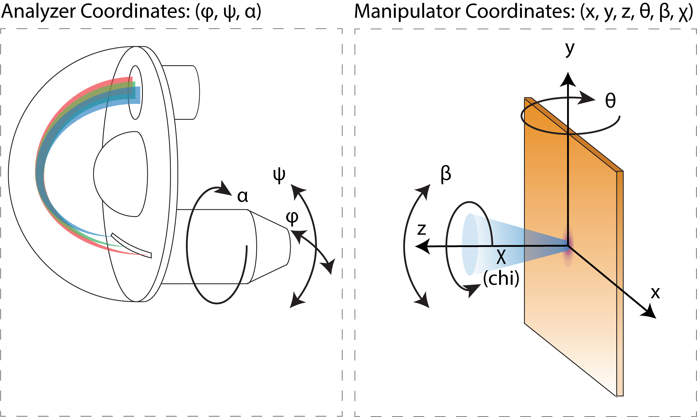

# The PyARPES Data Model and Conventions

## Coordinate conventions

The PyARPES coordinate representation is summarized in the figure below. 
Three spatial coordinates specify the manipulator translation relative 
to a fixed origin. Two manipulator angles ("theta" and "beta") specify the
orientation of the sample normal relative to the analyzer axis. A final azimuthal 
angle "chi" specifies the rotation of the sample face.

These six angles are not enough to fully specify the photocurrent though,
because the analyzer observes an angular cut which can be sometimes independently
manipulated. The angle along the analyzer slit is always labelled as "phi",
while the angle perpendicular to this one is labelled as "psi". This psi angle 
will be familiar to those using a deflector that allows recording Fermi surfaces
without sample motion. Finally, some analyzers allow rotation
along the analyzer axis. This is the "alpha" angle. As a convention
we will take alpha=0 when the the slit of the analyzer is in the x-z plane.

## ARPES Metadata

Convenient and consistent metadata conventions are essential in data analysis. 
Without consistent conventions, even basic analysis has to be done essentially manually 
and cannot easily be reused. Furthermore, offering convenient conventions for 
metadata reduces friction inherent in starting analysis for on data from new beamlines. 

PyARPES offers strong metadata support for experiments conducted at
synchrotron beamlines and those performed with lasers. 

### Coordinates

Coordinates are the most important metadata available. PyARPES
guarantees that every piece of data loaded through the provided plugins
contain the photon and binding energies as well as all of the six analyzer and 
sample angular coordinates. The physical sample position in millimeter units is also
provided.

### Scan Information

This includes coarse information about the scan that was performed to collect 
this ARPES data. You can access it at `.S.scan_info`

1. TODO Wall clock time
2. TODO scan_type
3. TODO experimenter
4. TODO sample
5. TODO date

### Experimental Conditions

You can access the experimental conditions with the 
`.S.experiment_info` accessor. TODO rename

Additionally, you can access any of the constituent pieces of 
metadata directly.

1. TODO temperature
2. TODO photon polarization
3. TODO photon flux
4. TODO photocurrent
5. TODO probe (x-ray or laser)
6. TODO probe detail (more specific probe information)
7. TODO analyzer
8. TODO analyzer detail (more specific info about analyzer)

### Analyzer Settings

1. lens_mode
2. acquisition_mode
3. entrance_slit_shape
4. entrance_slit_width
5. entrance_slit_number
6. pass_energy

### Beamline Settings

Metadata about the beamline is collected under `.S.beamline_info`

1. photon energy
2. TODO undulator gap
3. TODO linewidth
4. TODO photon polarization
5. TODO undulator info

### Data Acquisition Settings

Metadata about data acquisition settings is collected under `.S.daq_info`.
Because DAQ information depends highly on the implementation of DAQ programs,
this collection of metadata varies somewhat across beamlines and sources.    

1. Region number
2. DAQ scan type
3. region_info
4. region_size
5. prebinning_info
6. trapezoidal_correction_strategy
7. dither_settings
8. sweep_settings
9. frames_per_slice
10. frame_duration # this is largely a function of the beamline

### Laser/Pump-Probe Information

1. Pump wavelength (nm)
2. Pump energy (meV)
3. Pump fluence
4. Pump pulse energy
5. Pump spot size (um x um)
6. Probe spot size (um x um)
7. Pump probe offset (um x um)
8. Pump profile (CCD image)
9. Probe profile (CCD image)
10. Pump temporal width (fs)
11. Probe temporal width (fs)
12. Pump linewidth
13. Probe linewidth
14. Repetition rate
15. Sample reflectivity (at the current sample angle)

## The Sign of the Binding Energy

PyARPES makes a choice to represent the binding energy as negative below the 
Fermi level, this is opposite of the physical value (you can think of it instead
as the photoelectron kinetic energy but offset to align zero energy at the 
Fermi level). Nevertheless, it has the advantage of making math simpler, and 
orienting plots and figures in an aesthetically pleasing way.